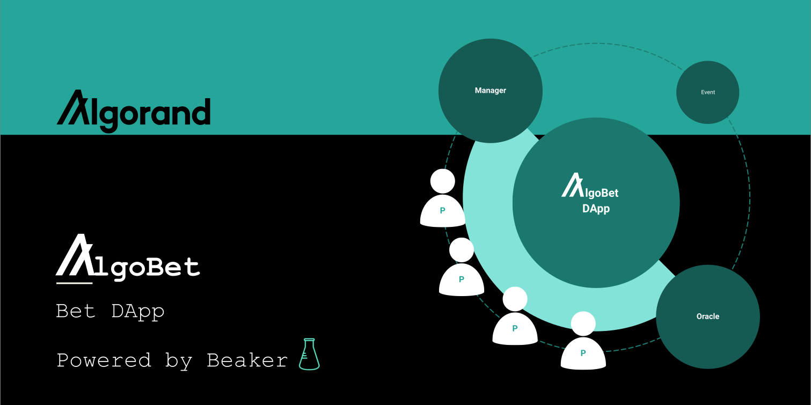
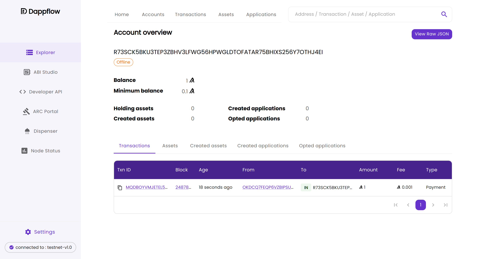

# AlgoBet - A decentralized bet system powered by Algorand

_Authors: Group 5 - Nicola Elia, Alessandro Parenti, Domenico Tortola_

This repository contains the deliverables related to the project work developed by Group #5 during
the [International School on Algorand Smart Contracts](https://algorand-school.github.io/algorand-school/) held online
on September 27 - October 18, 2022.

Current state: the proposal has been approved by the School's organising committee. The project has been developed.

## Table of contents

* [Project’s Goals](#project-s-goals)
  + [Description](#description)
* [State-of-the-art and arisen technical challenges](#state-of-the-art-and-arisen-technical-challenges)
  + [Similar use-cases implementations](#similar-use-cases-implementations)
  + [Smart contract development framework](#smart-contract-development-framework)
  + [Interfacing with real-world data: oracles](#interfacing-with-real-world-data--oracles)
  + [Smart contract testing: issues and workarounds](#smart-contract-testing--issues-and-workarounds)
    - [Features testing requirements](#features-testing-requirements)
    - [State-of-the-art testing environment issues](#state-of-the-art-testing-environment-issues)
    - [Implications on tests and proposed workarounds](#implications-on-tests-and-proposed-workarounds)
* [Smart Contract Specifications](#smart-contract-specifications)
  + [Global and Local state variables](#global-and-local-state-variables)
  + [Methods](#methods)
* [How to deploy and run](#how-to-deploy-and-run)
  + [Environment setup](#environment-setup)
  + [Run a Demo](#run-a-demo)
  + [Run the demo using the testnet](#run-the-demo-using-the-testnet)
  + [Run tests using sandbox in dev configuration](#run-tests-using-sandbox-in-dev-configuration)
  + [Run tests using sandbox to connect to devnet](#run-tests-using-sandbox-to-connect-to-devnet)
  + [Compile to TEAL](#compile-to-teal)
* [Future works and improvements](#future-works-and-improvements)
* [Live showcase](#live-showcase)

## Project’s Goals

AlgoBet project addresses the definition of a basic decentralized bet system, and its implementation by means of an
Algorand smart contract.

### Description

AlgoBet builds a **decentralized bet system**, in which many unknown participants may bet on the result of a particular
event. The smart contract would collect the bids and - at the end of the event - it will automatically distribute the
payouts between the winning participants.

At creation time, a *manager* and an *oracle* accounts are chosen, such that they have different permissions among the
smart contract functionalities. The smart contract instances are disposable, and each one of them represents a
particular event. In other words, one may instantiate an AlgoBet contract per each event to bet on.

The current implementation allows the participants to place bets by paying a fixed rate (140 milliAlgos). Participants
are not allowed to place a bet with a higher stake, nor to bet twice. They also cannot place multiple bets with
different options.

The account creator has also to specify the Unix timestamps of the event start and end, and an amount of time - since
event end - in which participants are allowed to request the payout while the manager will not be able to delete the
smart contract.

To support Algorand ecosystem development, particular focus has been given to the usage of
the [beaker](https://github.com/algorand-devrel/beaker) development framework and to the implementation of smart
contract tests over the [sandbox](https://github.com/algorand/sandbox) dev environment
using [pytest](https://github.com/pytest-dev/pytest/) framework.

## State-of-the-art and arisen technical challenges

This section will discuss the state-of-the-art and the technical challenges arisen during the project development.

### Similar use-cases implementations

A [post](https://forum.algorand.org/t/algorand-bet-my-first-attempt-at-a-dapp/3957) exists on the Algorand Forum,
regarding the realization of a bet system DApp. The project seems dismissed.

The only reference we could find to a working decentralized bet system based on Algorand is represented
by [AlgoBets](https://github.com/lucasvanmol/algobets), a teal-based project currently running
at [https://lucasvanmol.github.io/algobets/](https://lucasvanmol.github.io/algobets/) (it seems non-active).
\
Based on the project description on the GitHub repository, we could compare the AlgoBets project features to our owns:

| ***Features***                             | *Algobets* | *Our project* |
|--------------------------------------------|------------|---------------|
| Autonomous payment transactions management | **✓**      | **✓**         |
| Undefined number of participants           | **✓**      | **✓**         |
| Custom Oracle for event result             | ✘          | **✓**         |
| High-level language                        | ✘          | **✓**         |
| Tests implementations                      | ✘          | **✓**         |

### Smart contract development framework

PyTeal is the most common Python development framework for writing contracts and compiling them into TEAL code. Despite
its great support for almost all the AVM functionalities, its usage appears pretty unfriendly and non-pythonic. To
support Algorand development ecosystem, [beaker](https://github.com/algorand-devrel/beaker) was born as a smart contract
development framework for PyTeal. Its goal is to provide a better development experience, improving the less
user-friendly aspects of PyTeal and, for such reason, we believe it to be an important step for the evolution and
expansion of Algorand ecosystem.

As of today, Beaker is in pre-alpha development status (`beaker-pyteal 0.2.2` package, released on Oct 12, 2022) and
even though the repository already contains a good amount of examples, the documentation is still insufficient to cover
all its functionalities.

Our project aims at covering a new use-case, providing a ready-to-go Beaker-based deployable example with a thorough
test set implementation on top of `pytest` framework.

### Interfacing with real-world data: oracles

The proposed use-case requires our smart contract to deal with data injection from the real world.
The actor which will push data from real-world to blockchain is often referred to as **oracle**.

AlgoBet smart contract allows to set an address as oracle address, thus authorizing it for executing the application
calls which deal with data injection. In the current implementation, the _oracle address_ will be the only account
address authorized for executing the transaction intended to publish the event result into the smart contract,
named `set_event_result`. Therefore, the oracle acts as a trusted third party in charge of injecting off-chain data -
events results, in this case - into the AlgoBet instance.

The proposed demo and tests make use of an account to act as oracle. Future implementations may refer an external smart
contract to act as oracle. Indeed, a C2C transaction may be triggered by the authorized oracle smart contract account to
notify an event result.

A state-of-the-art oracle provider is [Goracle](https://www.goracle.io/post/algorand-the-future-of-sports-betting). It
aims to implement Algorand oracles as data feeds from real-world data providers, such as weather services and sport
results providers. Indeed, [References](https://www.goracle.io/post/algorand-the-future-of-sports-betting) to sports
decentralized bet systems may be found on its blog.

### Smart contract testing: issues and workarounds

#### Features testing requirements

Often, when linking a smart contract to real-world events, it is necessary to provide the smart contract and real-world
with a **common timeline**. Transactions will therefore be able to make time comparisons against the common current
time.
\
Algorand, as most of the blockchains, includes a UTC timestamp in each forged block.
Therefore, within the context of an Algorand smart contract, the safe way of comparing a timestamp with current time is
to consider the _timestamp of the last forged block_ as _current timestamp_. It is clear that, due to the time interval
between the creation of blocks, the precision of the _last forged timestamp_ will depend on the amount of time elapsed
since the last block creation.
\
It is then clear that transactions that make use of **timestamps** must be automatically tested to ensure that the
time-based mechanisms are well-implemented.

If a smart contract deals with payment transactions, then the transactions which take care of transferring Algos or
tokens must be automatically tested to ensure that the payment-related mechanisms are well-implemented.
\
For instance, our smart contract must be secured against multiple payouts to the same participant, wrong computation of
payouts, or close-out transaction correctness. It is then clear that applications that make use of **payment
transactions** must be automatically tested to ensure that the transfer mechanisms are well-implemented.
\
Those kind of transactions may be tested by checking the **accounts balances** before and after the possible application
workflows, asserting that the balances have been correctly affected by the running application.

#### State-of-the-art testing environment issues

[sandbox](https://github.com/algorand/sandbox) is the state-of-the-art Algorand environment used for deploying and
testing smart contracts. It offers a `dev` configuration which is extremely useful for fast testing of an application.
Indeed, the `dev` configuration starts a private network in which every transaction being sent to the node automatically
generates a new block, rather than wait for a new round in real time. This allows instant transactions to happen, with
almost no time wait for consensus to be applied.

Unfortunately, the current `sandbox` implementation makes developers face some issues:

- As documented by [this](https://github.com/algorand/go-algorand/pull/4643) GitHub pull request
  and [this](https://github.com/algorand/go-algorand/issues/4642) GitHub issue, even though since approximately May,
  14th the Mainnet has had the reward rate set to 0 (in favor of the application of governance rewards mechanism), the
  default sandbox `dev` network continues to give rewards to its accounts.

- As documented by [this](https://github.com/algorand/go-algorand/issues/3192) GitHub issue, the default sandbox `dev`
  network keeps the time in sync only for about 25s after the last block creation.

- The default sandbox `dev` network does not create any block without a transaction being triggered.

#### Implications on tests and proposed workarounds

Considering the features testing requirements, it's possible to derive that the issues described in the previous
subsection cause, respectively, the following problems during tests:

- Account balances may be altered by network rewards, thus they are not reliable for checking transactions correctness.

- If time-dependent workflows need to wait more than 25s, then the network will exhibit an inconsistent behaviour.

- If a transaction needs to compare a timestamp with the current time, and thus it retrieves the last block timestamp
  from the blockchain, then the retrieved timestamp will be as old as the last executed transaction.

The workarounds proposed by us and applied within this repository project are, respectively:

- Make tests and assertions by looking at transaction details, rather than account balances. In this way, we prevent the
  rewards from altering the test results. Example extracted from `test/test_contract.py`:
  ```python
  def test_request_payout_winners(app_addr, participant_client):
    res = participant_client.call(App.payout)
    tx_amount = res.tx_info["inner-txns"][0]["txn"]["txn"]["amt"]
    tx_fee = res.tx_info["inner-txns"][0]["txn"]["txn"]["fee"]
    # This assertion can't be affected by network rewards
    assert tx_amount == (140000 * 3 / 2 - tx_fee)
   ```

- Make tests flows such that no more than 25s elapse between any transaction and the next one.

- Make the test environment to create a dummy transaction, which will be triggered whenever a new block is needed for
  making timestamp comparisons.
  When using `pytest` as test framework, a fixture may be used to dynamically configure a client ready to ping the dummy
  transaction. A snippet extracted from `test/test_contract.py` follows.
  ```python
    from contract import AlgoBet as App

    # Workaround for https://github.com/algorand/go-algorand/issues/3192 .
    # Add a dummy transaction to the smart contract. This transaction may be used for triggering
    # the creation of a new block when using a sandbox in dev mode. In this way, transactions
    # which depend on the timestamp of last forged block will be able to retrieve a recent block
    # for current timestamp estimation.
    @external
    def dummy(self):
        return Approve()
    
    App.dummy = dummy
  
    @pytest.fixture(scope="class")
    def ping_sandbox(self, get_client):
        """Require a dummy transaction for triggering the creation of a new sandbox block.
        Workaround for https://github.com/algorand/go-algorand/issues/3192 .
        """
        c = get_client()

        def _call_dummy(client=c):
            client.call(App.dummy)

        return _call_dummy
  ```

## Smart Contract Specifications

In our bet contract participants can bet on the result of a particular, pre-defined event.\
To enrich this section with a real-world this example, we took inspiration from main team sports’ matches, such as
football or basketball, which can have three possible general results: _team1 win_, _team2 win_, _tie_.

The bet stake is predefined. After the end of the event, winning participants can have the payout transferred to his or
her wallet by calling the relative function. Non-winning participants would not be able to claim any reward.

Following we have an overview of the main elements and features.

### Global and Local state variables

* _Involved actors_:
  * _Manager (M)_: creates an event.
  * _Px, Py, ..._ : participants that place bets on the event.
  * _Oracle (O)_: at the end of the event, sets the final result.


* _Application state variables_:
  * `manager`: stores the creator address.
  * `oracle_addr`: stores the oracle address set by the manager.
  * `event_result`: stores the match result, updated by the oracle.
  * `bet_amount`: stores the fixed stake amount necessary for the bet.
  * `counter_opt_0`, `counter_opt_1`, `counter_opt_2`: store the number of bids on result 0, 1 and 2.
  * `stake_amount`: stores the whole stake amount collected by the contract through the bets.
  * `winning_count`: stores the number of winning accounts.
  * `winning_payout`: stores the amount of Algos constituting the payout.
  * `event_start_timestamp`: stores the event start time, expressed as Unix timestamp.
  * `event_end_timestamp`: stores the event end time, expressed as Unix timestamp.
  * `payout_time_window_s`: stores the timeframe in which participants can claim their winnings.


* _Account Variables_:
  * `chosen_opt`: stores the forecast bet by the participant.
  * `has_placed_bet`: flag that activates when after the bet is placed. Precludes the possibility of multiple bets.
  * `has_requested_payout`: flag activated after payout has been claimed. Precludes the reclaim of the same payout.

### Methods

The smart contract features private methods, exclusively accessible from the contract itself, indicated with
the `@internal` notation, and a set of exposed transactions indicated by the `@external` notation which can be called by
external clients.

* _Exposed Transactions_:
  * `create` (Smart Contract creation): may be used by the _Manager_ only, to issue the creation of a new Smart Contract
    related to a particular event (disposable Smart Contract fashion). At creation time, M sets the oracle address, the
    timestamps of start and end of the match and the time
    window granted to winning participants after the event for claiming their winnings.
  * `opt_in` (Smart Contract opt-in): may be used by each participant, to opt-in the Smart Contract.
  * `bet`: may be used by any participant _Px_ to place a bet on the smart contract event. In placing the bet, the
    participant may bid on one of the three predefined possible forecasts (1, X or 2 = 1, 0 or 2). The stake amount is
    fixed and predefined.
  * `set_event_result`: may be called by the authorized _Oracle_ only, to inject the event results into the smart
    contract. According to the aforementioned constraint, it cannot be called before the end of the event.
  * `payout`: may be called by winning participants to redeem their winnings. When successfully executed, this function
    triggers a flag in the calling participant local state, precluding him/her to reclaim the same payout.
  * `delete`: may be called by the _Manager_ only after the time_window has expired. It deletes the bet event and closes
    the smart contract account. The balance left in the contract is sent to the manager.


* _Internal Methods_:
  * `set_manager`: sets the manager address upon creation
  * `set_oracle`: sets the oracle address upon creation
  * `set_event_start_time`: sets the event start time
  * `set_event_end_time`: sets the event end time
  * `set_payout_time`: sets the time frame within which payouts can be requested.

## How to deploy and run

First, clone the repository. If you are going to use your own sandbox deployment, you can avoid recursing submodules. On
the other hand, if you want to use the sandbox that we included as a submodule, clone using:

``` shell
git clone --recurse-submodules https://github.com/n-elia/algobet.git
```

### Environment setup

A Python 3 installation is required to run the demo or tests.

Prepare a virtual environment and install the project requirements with:

```shell
python3 -m venv venv
cd src

pip install -r src/requirements.txt
pip install -r src/test/requirements.txt
```

### Run a Demo

To run a demo of this smart contract, provided that a sandbox network is up and running, just
execute the smart contract as python script:

```shell
cd src
python contract.py
```

The `demo()` method inside `src/contract.py` will be executed.

### Run the demo using the testnet

The tests can be run deploying the `sandbox` and attaching it to the `testnet`: `./sandbox up testnet`.
From `test/sandbox` folder, create a wallet and populate it with two accounts:

```shell
./sandbox enter algod
goal wallet new mywallet
goal account new -w mywallet
goal account new -w mywallet
```

Then, fund those accounts using the [testnet bank](https://bank.testnet.algorand.network/) faucet.

To make `beaker.sandbox` client able to access your wallet, edit the `contract.py/demo()` method as follows:

```python
# Pop an account from sandbox accounts
wallet_name = "mywalletname"
wallet_password = "mywalletpassword"
sandbox_accounts = sandbox.get_accounts(
    wallet_name=wallet_name,
    wallet_password=wallet_password,
)
```

Then, you will be able to run the demo script as explained in the previous subsection.

### Run tests using sandbox in dev configuration

Tests are implemented using the `pytest` test framework for Python.
To run tests, the sandbox in `dev`mode must be up and running.
Therefore, we provided the test suite with the possibility to set up and teardown the sandbox network during each test
session.

If you want to use the sandbox included into the repository, just skip to next step. Otherwise, depending on your
configuration, set up the `src/test/sandbox-scripts/sandbox_setup.sh`
and `src/test/sandbox-scripts/sandbox_teardown.sh` shell scripts to point to your `sandbox` folder.
Then, you can enable automatic execution of those scripts at each run by using the `--sandbox` parameter on the `pytest`
CLI.

To run the test suite with default settings, just issue:

``` shell
make test
```

The report will be located at `src/test/reports/pytest_report.html`. You can find a sample report there.

### Run tests using sandbox to connect to devnet

To run tests deploying the contract on `devnet`, you have to implement the snippet shown in _"Run the demo using the
testnet"_ section into `test_contract.py/TestBase.accounts()`.
Be sure to create enough accounts before running the tests.

### Compile to TEAL

Beaker framework can also be used for exporting TEAL code of the developed application.
The script `src/teal/compile.py` can be run to generate the Aprroval Program, Clear Program and transactions json:

```shell
cd src/teal/
python compile.py
```

## Future works and improvements

- Implement an always-on parent contract, which can be used to spawn AlgoBet child contracts, using the approach
  suggested in [algorand-devrel/parent-child-contracts](https://github.com/algorand-devrel/parent-child-contracts).

- Implement custom bet stake for each participant, thus adapting the payout system to more complex situations.

- Attach a state-of-the-art oracle smart contract, implementing a strategy for uniquely identifying the events.

- Develop a mechanism to make the contract account hold enough Algos to pay transaction fees in variable transaction
  fees scenarios.

## Live showcase

To showcase our DApp, we set up an AlgoBet contract, created on `testnet` on Mon, 17 October 2022 20:00:25 (TX ID:
`MQDBOYVMJETEL5KTVUYUAMLKRAXF2GE2KNEUOQIQQ773OV555RQQ`).\
You can browse the AlgoBet contract
account [here](https://app.dappflow.org/explorer/account/R73SCK5BKU3TEP3ZBHV3LFWG56HPWGLDTOFATAR75BHIXS256Y7OTHJ4EI/transactions)
on Dappflow.



The event end has been set on: Tuesday 18 October 2022 17:00:00 (GMT).

Feel free to test it, placing your bets. You will have 24h since the end of the event to request your payout.
**Good luck!**

Update: the event ended, so the result has been set by the oracle and the winner participants have been allowed for
payout!